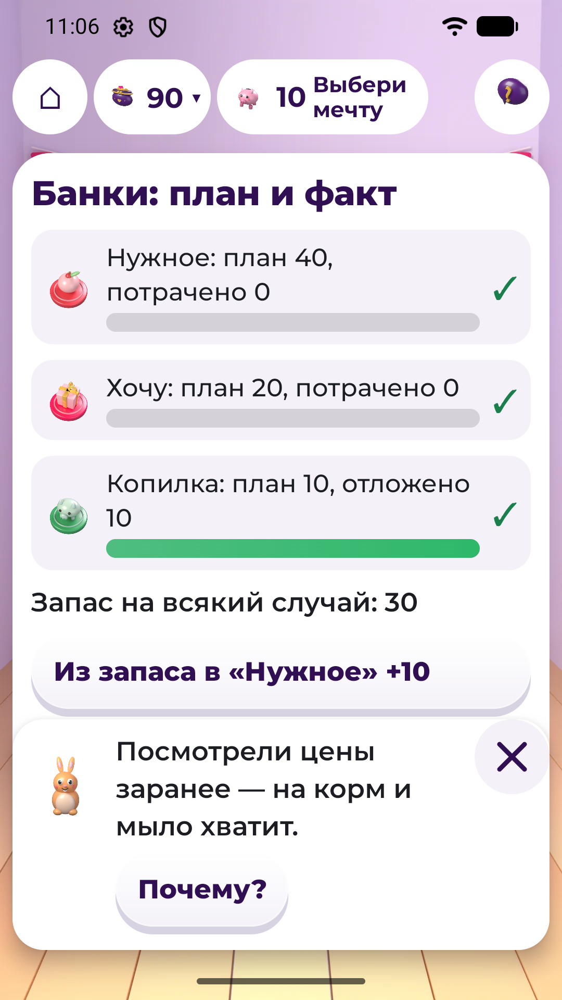
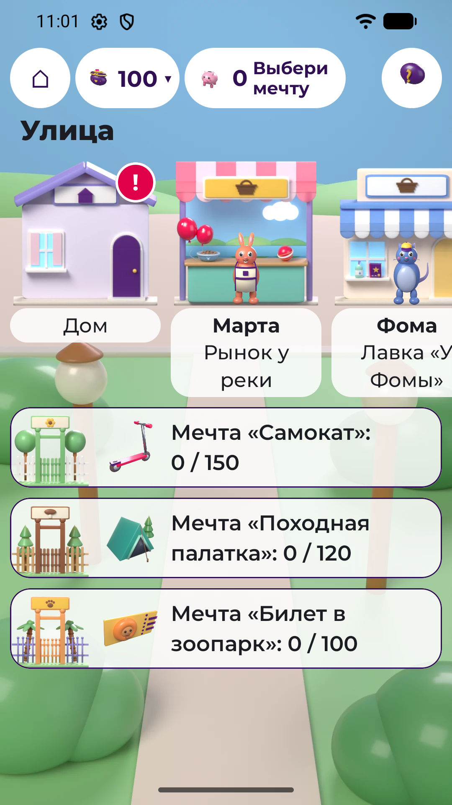
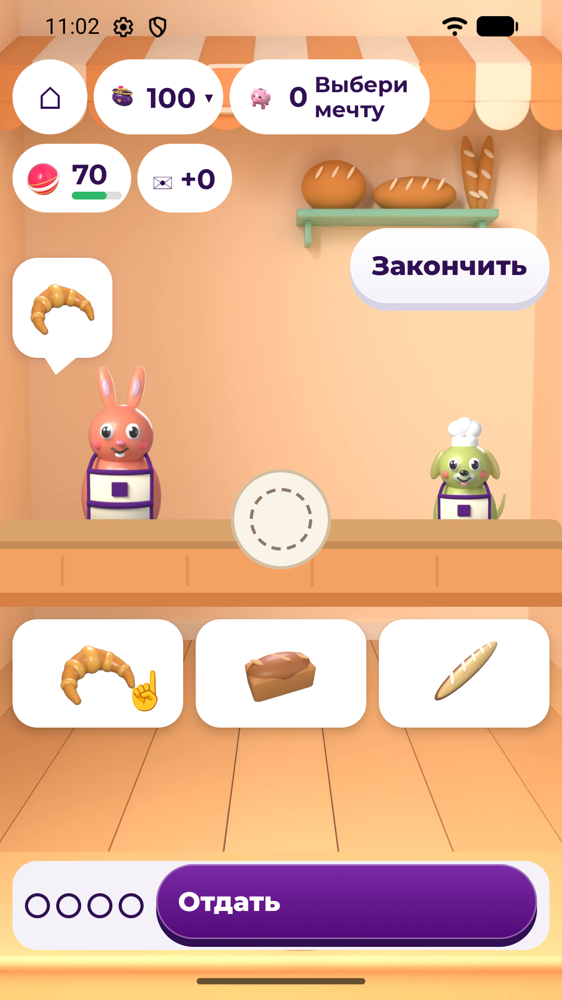

# Питомец Финни

Android-игра по финансовой грамотности для детей 7–11 лет: ребёнок живёт с питомцем в маленьком
городке, раскладывает карманные деньги по банкам, выбирает, где купить дешевле, помогает соседям
за зарплату и копит на мечту.

| | |
|---|---|
| Конкурс | «Лидеры цифровой трансформации» 2026, кейс 06 |
| Заказчик | Департамент финансов города Москвы |
| Команда | «Сингулярность Бытия»: Ким Владимир, Цирпка Денис |
| Версия | 1.4.1 (versionCode 6), пакет `ru.finny.pet` |
| Репозиторий | https://github.com/denis-zierpka/lct-hackaton-2026-case-06 |

## Что это

Выпуск 1.4.1 — вариант `game` на концепции «Городок» ([docs/GAME_CONCEPT.md](docs/GAME_CONCEPT.md)).
Ребёнок создаёт питомца (кот, зайка или щенок, 3 цвета, своё имя) и живёт с ним в комнате.
Каждую игровую неделю почтальон приносит конверт: 100 монет карманных и то, что заработано
за прошлую неделю.

- **Комната** — главный экран: питомец, кошелёк, копилка с мечтой, сытость, чистота и настроение,
  карточка «В городке» с текущим событием. Мебель ведёт к делам: холодильник со списком покупок,
  полка с банками, окно на улицу с жителем недели, дверь, почтовый ящик, сундук (обустроить комнату)
  и кровать «Сон». Внизу — «Банки», «Лавки», «Копилка», «События», «Дневник».
- **Банки «Нужное», «Хочу», «В копилку».** В начале недели монеты раскладываются по банкам шагом 10;
  не разложенное остаётся запасом на всякий случай. После «Готово» план не меняется до нового
  конверта, а в конце недели сравнивается с тем, как вышло.
- **Улица**: дом, «Рынок у реки», лавка «У Фомы» и пекарня — у каждого места свой фасад, у лавок
  и пекарни — житель; «!» — там ждёт событие. Ниже — калитки парка, леса у озера и зоопарка:
  на каждой мечта, её цена и сколько уже в копилке.
- **Две лавки с кассой.** 23 товара, нужные и для радости; одинаковое стоит по-разному
  (корм у реки 20, у Фомы 30; мыло 12 и 10). Касса показывает цену, банку и что будет с питомцем.
  Если не хватает — говорит сколько и предлагает выход: дешевле, из запаса, из «Хочу», подождать
  конверта или сделать вещь мечтой. В минус уйти нельзя.
- **Смены у соседей.** В пекарне Боря просит собрать поднос по заказу покупателя, у Марты на рынке —
  три поручения. За смену — от 6 монет, в пекарне ещё до 4 за звёзды; до 3 смен в неделю на все работы.
  Зарплата приходит в конверт следующей недели и план текущей не ломает. В пекарне есть
  «Загадка Бори» (15 вопросов): верный ответ — Боря помогает с подносом.
- **События вместо заданий.** 6 событий, по два на тему «бюджет», «сбережения», «покупки»:
  «Список на неделю», «Корм подорожал», «Распродажа робота», «Мечта почти твоя», «Где дешевле»,
  «Супер-корм». Решаются поступком — что и где купить, из какой банки, отложить или пройти мимо.
  После любого исхода — короткое объяснение, после ошибки — как исправить.
- **Мечты и копилка.** 5 мечт (от красок за 80 до самоката за 150) или своя. Банка «В копилку»
  ссыпается в свинку при «Готово», докладывать можно из запаса и из «Хочу». Видно, сколько
  накоплено, сколько осталось и примерно через сколько конвертов мечта сбудется. Взять из копилки —
  только после подтверждения.
- **Ночь и итог недели.** В неделе 3 игровых дня, день кончается сном в кровати. После последнего
  дня — итог: план и факт по банкам, три штампа («Нужное куплено», «По плану», «Отложено»), очки
  роста и «Что поменяем в новом плане?». Питомец растёт по штампам: 3 стадии, вторая — с 4 очков,
  третья — с 9. Рост не откатывается; от ошибок питомец только грустит, не болеет и не умирает.
- **«Дневник»**: рост, итоги недель, лучшая смена, что придёт с новым конвертом, журнал монет
  с источником каждого начисления, справка из 10 терминов.
- **Раздел для взрослого** за простым барьером (пример на умножение): чему учит игра, прогресс
  ребёнка, бонус +10 монет в конверт (до 3 раз в неделю), звуки, музыка, анимации, демо-режим,
  сброс и удаление профиля.

Без регистрации, интернета, рекламы и реальных денег. Числа экономики — в
[content.json](finny-pet/app/src/main/assets/content/content.json), формулы —
[ECONOMY.md](finny-pet/docs/ECONOMY.md#городок-движок-среза-1).

Чего в 1.4.1 пока нет: мастерской, дома Тоши и мест за калитками (срез 2); стартовое бра в комнате
не показывается (у товаров, вещей и мечт свои картинки с 1.4.1, TOWN-A1e2);
питомец — 2D-спрайты, 3D — к финалу.
Весь список — [LIMITATIONS_ROADMAP.md](finny-pet/docs/LIMITATIONS_ROADMAP.md).

История: выпуск 1.3.0 (тег `v1.3.0`, 2026-09-25) был другой игрой — план
бюджета, магазин и задания с выбором ответа. Что поменялось — [CHANGELOG.md](finny-pet/CHANGELOG.md).
Вариант `classic` (`ru.finny.pet.classic`) остаётся на правилах 1.3.0 и в сдачу не входит.

## Стек

| Что | Версия |
|---|---|
| Язык, UI | Kotlin 2.4.20, Jetpack Compose (BOM 2026.06.01, Material 3), шрифт Montserrat |
| Данные | kotlinx.serialization: контент — `assets/content/content.json`, профиль — `state.json` во внутренней памяти |
| Сборка | Gradle 9.4.1 (wrapper с `distributionSha256Sum`), AGP 9.2.1, JDK 17 |
| Android | minSdk 26 (Android 8.0), compileSdk / targetSdk 36 |
| Тесты | JUnit 4, JVM-тесты правил игры |
| Ассеты | собственные: Blender и Python-скрипты в `finny-pet/tools/art/` |

Один Gradle-модуль, без сервера. Правила игры — чистый Kotlin в `domain/` (движок «Городка» —
`domain/town/`), экраны — в `app/src/game/`. Два варианта сборки: `game` — сдаётся; `classic`
(`ru.finny.pet.classic`) остаётся в репозитории и в сдачу не входит.

## Как запустить

### Готовый APK

[`finny-pet/release/finny-pet-1.4.1-release.apk`](finny-pet/release/finny-pet-1.4.1-release.apk)
(4 637 942 байт, Android 8.0 и новее). Скопировать на телефон и установить (разрешить установку
из неизвестных источников) или:

```bash
adb install -r finny-pet/release/finny-pet-1.4.1-release.apk
```

Для промежуточной сдачи APK подписан отладочным ключом (`CN=Android Debug`), как 1.3.0 и 1.4.0 (ставится поверх них);
постоянный ключ — к финалу. Если на устройстве стоит сборка с другой подписью, сначала
`adb uninstall ru.finny.pet`. Сохранение 1.3.0 новая версия читает: монеты и копилка на месте,
неистраченное по плану недели ложится в банки.

### Демо-режим

Для эксперта: «Для взрослого» (на титульном экране или значок замка в комнате) → пример на
умножение → «Войти» → «Создать тестовый профиль (демо)» → «Да, продолжить». Прогресс стирается,
включается демо-режим, открывается знакомство — питомца создают заново.

Неделя — счётчик из 3 игровых дней, а не календарь, поэтому недели идут подряд и без демо.
Демо-режим добавляет: ночью — «Сразу к итогу недели» (после раскладки по банкам), на доске
«События» — все события с кнопкой «Начать», в лавках — все товары сразу, в пекарне — короткие
заказы. Переключатель «Демо-режим» там же включает демо без сброса, «Сбросить профиль» — начать
заново. Путь показа по шагам Приложения А —
[BUILD_AND_DEMO.md](finny-pet/docs/BUILD_AND_DEMO.md#сценарий-демонстрации-приложение-а).

### Из исходников

Нужны JDK 17 и Android SDK (platform 36, build-tools 36.0.0). Команды — из `finny-pet/`:

```bash
# Linux / macOS
./gradlew testGameDebugUnitTest assembleGameRelease

# Windows: в local.properties — sdk.dir=C\:/Users/<имя>/AppData/Local/Android/Sdk
gradlew.bat testGameDebugUnitTest assembleGameRelease
```

APK: `app/build/outputs/apk/game/release/app-game-release.apk`
(отладочный — `assembleGameDebug` → `.../game/debug/app-game-debug.apk`).
Подпись, установка, демо-режим, сброс профиля и сквозной сценарий —
[finny-pet/docs/BUILD_AND_DEMO.md](finny-pet/docs/BUILD_AND_DEMO.md).

## Скриншоты

Снимки выпуска 1.4.1 (ТЗ 7.1 п. 5: создание питомца, главный экран, бюджет или накопления).

| Создание питомца | Комната — главный экран | Банки — бюджет недели |
|---|---|---|
|  |  |  |
| **Копилка и мечта** | **Улица** | **Пекарня** |
|  |  |  |

## Реализованные требования

Полная таблица по ТЗ 7.1 п. 6 — статусы «реализовано», «в работе», «не начато», где это в коде,
как проверено и план до финала — [REQUIREMENTS_MATRIX.md](finny-pet/docs/REQUIREMENTS_MATRIX.md).
Итог по ней:

| Раздел ТЗ | Реализовано | В работе | Не начато |
|---|---|---|---|
| 2.1 Цель и задачи продукта | — | 1 | — |
| 2.5 Обязательные функции | 40 | 3 | — |
| 2.6–2.8 Объём контента, границы, дополнительные возможности | 14 | — | — |
| 3 Программно-аппаратные требования | 25 | 13 | 1 |

Все группы 2.5 (2.5.1–2.5.14) и весь минимальный объём контента 2.6 есть в игре. В работе:

- 2.5.7 — срок мечты считается по среднему взносу, но из чего он получился, ребёнку не показано;
- 2.5.11 и 2.5.12 — списка пройденных событий в «Дневнике» и пройденных тем у взрослого пока нет
  (срез 2);
- 2.1 — итог смены: осталось доснять на телефоне и проверить с TalkBack вручную;
- 3 — проверки на телефоне (демо-путь «Городка» целиком, скорость на слабом телефоне, шрифт 130 %, контраст, звук на
  слух, TalkBack), Android 8, постоянный ключ подписи, карточка RuStore, проверка с детьми;
  не начато — планшет и альбомная ориентация.

План до финала — [LIMITATIONS_ROADMAP.md](finny-pet/docs/LIMITATIONS_ROADMAP.md#план-до-финала-тз-72),
вопросы заказчику — [QUESTIONS.md](finny-pet/docs/QUESTIONS.md).

Проверка 1.4.1 (2026-09-29, тег `v1.4.1`): 600 JVM-тестов на вариант, 0 падений; lint — 0 ошибок.
**Физическое устройство (ТЗ 3.1.3):** Samsung Galaxy S23 (Android 14, 8 ГБ, 360 dp) — экраны
«Городка» 2026-09-26; сценарий Приложения А целиком на телефоне прошёл выпуск 1.3.0 (2026-09-25,
[TEST_CASES.md](finny-pet/docs/TEST_CASES.md#отчёт-с-физического-устройства)); демо-путь «Городка»
целиком — на эмуляторе 2026-09-26 (сборка 12a4394, шаг 6 — смена у Марты); на сборке 1.4.1 —
маршрут демо-профиля `tools/town_route.sh` на release 1.4.1 (эмулятор 360 × 640, шрифт 1,0 и 1,3): промахов 0, `GEOM OK` 8, `CLOSE OK` 2, обрезки 0; с него сняты ключевые экраны 02–06, экран 01 — с чистого запуска; таблица шагов 1–12 с числами построчно не сверялась; обновление 1.3.0 → 1.4.0 и 1.4.0 → 1.4.1 с живым профилем — без падений. **Не проверено:** звук и плавность на слух и на глаз,
пользовательская проверка (ТЗ 8.4, протокол — [USER_TESTING.md](finny-pet/docs/USER_TESTING.md)).

## Промежуточная сдача (ТЗ 7.1)

| № | Что требует ТЗ 7.1 | Где лежит |
|---|---|---|
| 1 | Ссылка на Git-репозиторий | этот репозиторий, ссылка — в шапке |
| 2 | README: стек, способ запуска, реализованные требования | этот файл: [Стек](#стек), [Как запустить](#как-запустить), [Реализованные требования](#реализованные-требования) |
| 3 | Рабочая сборка APK | [finny-pet/release/finny-pet-1.4.1-release.apk](finny-pet/release/finny-pet-1.4.1-release.apk); Figma-прототипа не было |
| 4 | Архитектура и структура данных | [ARCHITECTURE.md](finny-pet/docs/ARCHITECTURE.md), [DATA_MODEL.md](finny-pet/docs/DATA_MODEL.md), [ECONOMY.md](finny-pet/docs/ECONOMY.md) |
| 5 | Не менее трёх ключевых экранов | [finny-pet/screenshots/game/](finny-pet/screenshots/game/): создание питомца, комната — главный экран, банки — бюджет, копилка, улица, пекарня |
| 6 | Таблица требований со статусами и планом до финала | [REQUIREMENTS_MATRIX.md](finny-pet/docs/REQUIREMENTS_MATRIX.md), итог — [Реализованные требования](#реализованные-требования), сводный план — [LIMITATIONS_ROADMAP.md](finny-pet/docs/LIMITATIONS_ROADMAP.md#план-до-финала-тз-72) |
| 7 | Вопросы и ограничения для консультации с заказчиком | [QUESTIONS.md](finny-pet/docs/QUESTIONS.md) |

К финалу по ТЗ 7.2: релизный тег финальной версии и история изменений
([CHANGELOG.md](finny-pet/CHANGELOG.md)), DOCX (раздел 5), презентация (4), резервное видео (4.1),
скриншоты для RuStore (3.3). Сверх 7.2, план команды: постоянный ключ подписи (3.3, 3.4), витрина
лавки с продавцом (A1s), 3D-питомец ([docs/ART_PIPELINE.md](docs/ART_PIPELINE.md)). Весь список —
[план до финала](finny-pet/docs/LIMITATIONS_ROADMAP.md#план-до-финала-тз-72).

## Документация

Для сдачи (раздел 5 ТЗ и 7.1), в `finny-pet/docs/`:

- [BUILD_AND_DEMO.md](finny-pet/docs/BUILD_AND_DEMO.md) — окружение, сборка, установка, демо-режим, сброс
- [ARCHITECTURE.md](finny-pet/docs/ARCHITECTURE.md) — компоненты, поток данных, обновление контента
- [DATA_MODEL.md](finny-pet/docs/DATA_MODEL.md) — профиль, экономика, события, прогресс
- [ECONOMY.md](finny-pet/docs/ECONOMY.md) — формулы: монеты, банки, касса, смены, рост питомца
- [CONTENT_MAP.md](finny-pet/docs/CONTENT_MAP.md) — темы, навыки, события, объяснения
- [REQUIREMENTS_MATRIX.md](finny-pet/docs/REQUIREMENTS_MATRIX.md) — требования ТЗ 2.1, 2.5–2.8 и 3
  для `game`: статус, где в коде, как проверено, план до финала
- [UX_ACCESSIBILITY.md](finny-pet/docs/UX_ACCESSIBILITY.md) — UX и доступность
- [PRIVACY_PERMISSIONS.md](finny-pet/docs/PRIVACY_PERMISSIONS.md) — разрешения, данные, удаление профиля
- [TEST_CASES.md](finny-pet/docs/TEST_CASES.md) — тест-кейсы и отчёт о проверке
- [USER_TESTING.md](finny-pet/docs/USER_TESTING.md) — протокол пользовательской проверки (ТЗ 8.4)
- [QUESTIONS.md](finny-pet/docs/QUESTIONS.md) — вопросы заказчику
- [LIMITATIONS_ROADMAP.md](finny-pet/docs/LIMITATIONS_ROADMAP.md) — ограничения и план развития
- [LICENSES.md](finny-pet/docs/LICENSES.md) — библиотеки, шрифты, изображения, звуки
- [RUSTORE_CARD.md](finny-pet/docs/RUSTORE_CARD.md) — черновик карточки RuStore
- [PLAN.md](finny-pet/docs/PLAN.md), [GAME_PLAN.md](finny-pet/docs/GAME_PLAN.md) — исторические: план работ
  и переход к игровому варианту до 1.3.0

История выпусков — [finny-pet/CHANGELOG.md](finny-pet/CHANGELOG.md).

Рабочие, в `docs/`: [README.md](docs/README.md) (путеводитель и ТЗ в `sources/`),
[GAME_CONCEPT.md](docs/GAME_CONCEPT.md) (концепция «Городок» и демо-путь),
[competencies.md](docs/competencies.md) (привязка механик к Единой рамке компетенций),
[BACKLOG.md](docs/BACKLOG.md), [ART_PIPELINE.md](docs/ART_PIPELINE.md), [WORKFLOW.md](docs/WORKFLOW.md).

Открытой лицензии у репозитория нет; права на сторонние компоненты — [LICENSES.md](finny-pet/docs/LICENSES.md).

## Процесс разработки

Код пишется в контуре с ИИ-агентами (Claude Code). Оркестратор пишет спеку задачи
(`docs/tasks/<ID>.md`: MVP-* — выпуск 1.3.0, TOWN-* — «Городок», выпуски 1.4.0 и 1.4.1) и машинную приёмку.
Отдельный агент до кода пишет тесты-оракул, кодер работает только в списке разрешённых файлов и не
может менять тесты (хуки `.claude/hooks/`), ревьювер без контекста кодера выносит PASS/FAIL.
Коммиты — по задачам. Процесс — [docs/WORKFLOW.md](docs/WORKFLOW.md), инварианты проекта («доки не
врут о коде», числа экономики только в `content.json`, ноль разрешений и сети) — [CLAUDE.md](CLAUDE.md).

## Структура репозитория

```
docs/                    ТЗ и рамка компетенций (sources/), концепция, спеки задач (tasks/), процесс, бэклог
finny-pet/               Android-проект (Gradle), команды сборки — отсюда
  app/src/main/          общий код: domain/ (правила, чистый Kotlin; «Городок» — domain/town/), data/, content.json, спрайты питомца
  app/src/game/          сдаваемый вариант: комната, улица, лавки, пекарня, звуки
  app/src/classic/       вариант classic, в сдачу не входит
  app/src/test/          JVM-тесты правил
  docs/                  документация для сдачи
  release/               APK для сдачи
  screenshots/game/      ключевые экраны
  tools/art/             генераторы ассетов: питомец и жители, комната и мебель, фоны мест, фасады улицы, вещи, звуки
  tools/office/, tools/demo_run.sh, tools/ui.py   DOCX/PPTX и автопрогон демо — к финалу
tools/                   живая проверка на эмуляторе и телефоне (emu.sh, adbui.sh, town_route.sh), приёмка арта (art_check.py)
.claude/                 агенты и хуки контура
CLAUDE.md                инварианты проекта
```

Актуально на версию 1.4.1 (2026-09-29)
