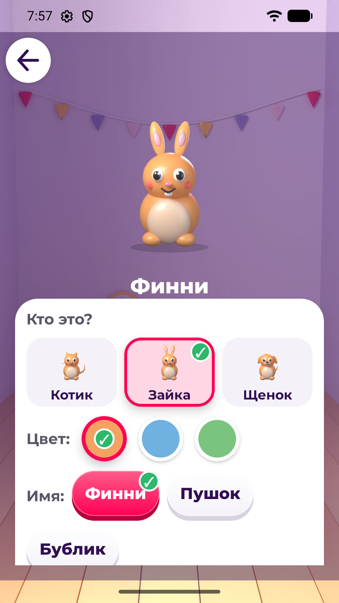
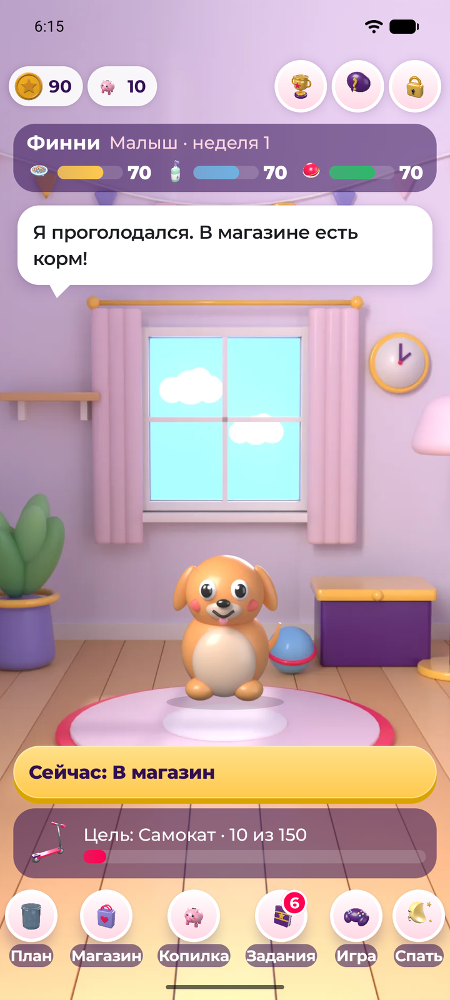
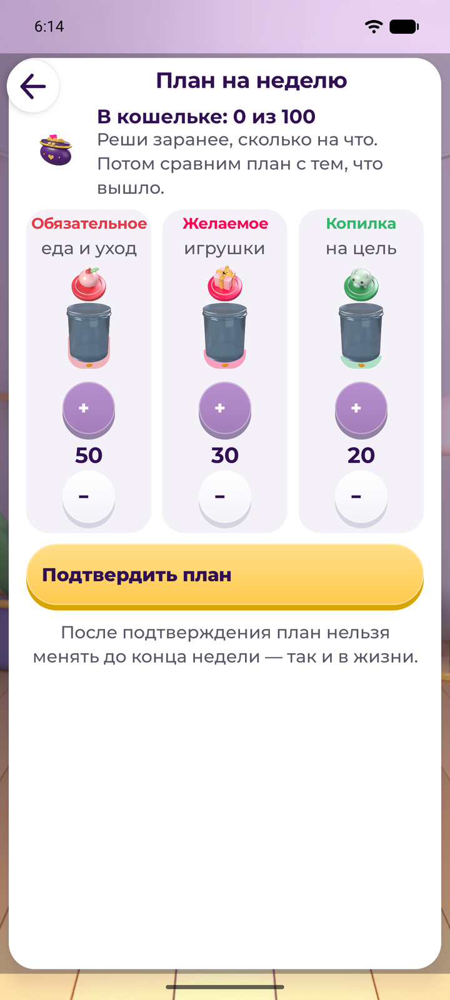
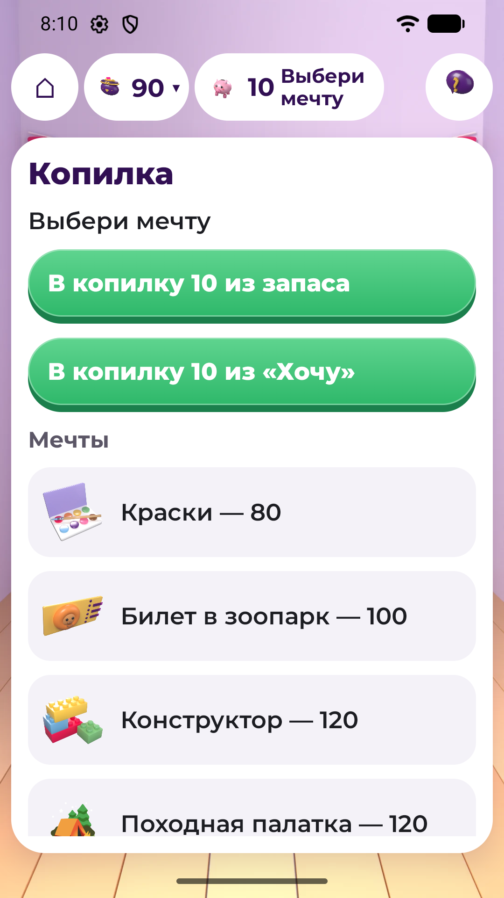

# Питомец Финни

Android-игра по финансовой грамотности для детей 7–11 лет: ребёнок заботится о питомце
и учится планировать карманные деньги, выбирать покупки и копить на цель.

| | |
|---|---|
| Конкурс | «Лидеры цифровой трансформации» 2026, кейс 06 |
| Заказчик | Департамент финансов города Москвы |
| Команда | «Сингулярность Бытия»: Ким Владимир, Цирпка Денис |
| Версия | 1.3.0 (versionCode 4), пакет `ru.finny.pet` |
| Репозиторий | https://github.com/denis-zierpka/lct-hackaton-2026-case-06 |

## Что это

Ниже — выпуск 1.3.0 (APK промежуточной сдачи). В ветке `feat/town` вариант `game` переведён на
концепцию «Городок» ([docs/GAME_CONCEPT.md](docs/GAME_CONCEPT.md), задача TOWN-S1d — реализовано, ждёт ревью): главный экран —
комната, монеты раскладываются по банкам «Нужное», «Хочу», «В копилку», покупки — в двух лавках с
разными ценами через кассу, заработок — смены у соседей (приходит с новым конвертом), вместо
заданий — события городка. Экранов плана, магазина и заданий 1.3.0 в `game` нет; `classic` работает
по правилам 1.3.0.

Ребёнок создаёт питомца (кот, зайка или щенок, 3 цвета, своё имя) и живёт с ним в комнате.
Каждую игровую неделю приходят 100 монет карманных денег. Сначала ребёнок делит их планом
на три части: обязательное (еда, уход), желаемое (игрушки) и копилка. Потом покупает,
откладывает на цель и решает задания: за верный ответ +10 монет, за неверный +5 и объяснение.
После плана открывается мини-игра «Монетки в ряд» (до 30 монет в неделю). Неделя
закрывается кнопкой: итог сравнивает план и факт, объясняет, почему у питомца изменились
сытость, чистота и настроение, и что поправить. Питомец растёт по очкам роста: за неделю
до 3 (еда и уход куплены, план соблюдён, копилка выросла); 3 стадии, вторая — с 4 очков,
третья — с 9. Рост не откатывается, от ошибок питомец не болеет и не умирает.
Без регистрации, интернета, рекламы и реальных денег. Взрослый за простым барьером видит прогресс, настраивает звук и может дать бонус
за дело (+10, до 3 раз в неделю). Формулы — [ECONOMY.md](finny-pet/docs/ECONOMY.md).

## Стек

| Что | Версия |
|---|---|
| Язык, UI | Kotlin 2.4.20, Jetpack Compose (BOM 2026.06.01, Material 3), шрифт Montserrat |
| Данные | kotlinx.serialization: контент — `assets/content/content.json`, профиль — `state.json` во внутренней памяти |
| Сборка | Gradle 9.4.1 (wrapper с `distributionSha256Sum`), AGP 9.2.1, JDK 17 |
| Android | minSdk 26 (Android 8.0), compileSdk / targetSdk 36 |
| Тесты | JUnit 4, JVM-тесты правил игры |
| Ассеты | собственные: Blender и Python-скрипты в `finny-pet/tools/art/` |

Один Gradle-модуль, без сервера. Два варианта сборки: `game` — сдаётся; `classic`
(`ru.finny.pet.classic`) остаётся в репозитории и в сдачу не входит.

## Как запустить

### Готовый APK

[`finny-pet/release/finny-pet-1.3.0-release.apk`](finny-pet/release/finny-pet-1.3.0-release.apk)
(≈ 3,9 МБ, Android 8.0 и новее). Скопировать на телефон и установить (разрешить установку
из неизвестных источников) или:

```bash
adb install -r finny-pet/release/finny-pet-1.3.0-release.apk
```

Для промежуточной сдачи APK подписан отладочным ключом (`CN=Android Debug`), постоянный
ключ — к финалу. Если на устройстве стоит старая сборка с другой подписью, сначала
`adb uninstall ru.finny.pet`.

Демо-режим для эксперта: «Для взрослого» (значок замка) → пример на умножение →
«Создать тестовый профиль (демо)». Все задания открыты сразу, недели идут подряд
без ожидания, профиль сбрасывается там же.

### Из исходников

Нужны JDK 17 и Android SDK (platform 36, build-tools 36.0.0). Команды — из `finny-pet/`:

```bash
# Linux / macOS
./gradlew testGameDebugUnitTest assembleGameRelease

# Windows: в local.properties — sdk.dir=C\:/Users/<имя>/AppData/Local/Android/Sdk
gradlew.bat testGameDebugUnitTest assembleGameRelease
```

APK: `app/build/outputs/apk/game/release/app-game-release.apk`
(отладочный — `assembleGameDebug` → `.../game/debug/app-game-debug.apk`).
Подпись, установка, демо-режим, сброс профиля и сквозной сценарий —
[finny-pet/docs/BUILD_AND_DEMO.md](finny-pet/docs/BUILD_AND_DEMO.md).

## Скриншоты

| Создание питомца | Главный экран | План бюджета | Копилка |
|---|---|---|---|
|  |  |  |  |

## Реализованные требования

Статусы — по выпуску 1.3.0. Обязательные функциональные требования ТЗ 2.5 и минимальный объём контента 2.6 реализованы,
кроме одного пункта в работе: задания-действия по 2.5.8 (сейчас задания с выбором ответа
и вводом числа; достаточно ли этого — вопрос заказчику № 1 в [QUESTIONS.md](finny-pet/docs/QUESTIONS.md)).
Статусы в формулировках ТЗ 7.1 п. 6 — в таблице ниже, план до финала —
[LIMITATIONS_ROADMAP.md](finny-pet/docs/LIMITATIONS_ROADMAP.md#план-до-финала-тз-72).

| ТЗ | Статус | Кратко |
|---|---|---|
| 2.5.1–2.5.2 | реализовано | Знакомство, гостевой режим (только игровое имя), питомец: 3 вида × 3 цвета, подсказка с главного экрана |
| 2.5.3 | реализовано | Главный экран: питомец, монеты, копилка, цель, показатели. Активное задание — плашка «Сейчас» со следующим шагом недели: план, покупка, цель, копилка, задания, итог (`RoomScreen.kt`, `GameViewModel.nextStep` — тег `v1.3.0`) |
| 2.5.4–2.5.5 | реализовано | Игровые монеты с источником каждого начисления; план по 3 направлениям, остаток, план/факт |
| 2.5.6 | реализовано | 10 товаров (5 обязательных, 5 желаемых), подтверждение покупки, баланс не уходит в минус |
| 2.5.7 | реализовано | 4 цели и своя, взносы, срок по среднему взносу, снятие с подтверждением |
| 2.5.8 | реализовано, кроме п. 2 — в работе | 10 заданий по 3 темам: 7 с выбором, 3 с вводом числа, объяснение после любого ответа. Задания-действия (покупка, копилка, правка плана) — к финалу |
| 2.5.9–2.5.10 | реализовано | Обратная связь после действия, итог недели с путём исправления; питомец: 3 стадии роста, 3 настроения с объяснением причины |
| 2.5.11 | реализовано | Прогресс, журнал «Откуда монеты», справочник из 10 терминов |
| 2.5.12 | реализовано | Раздел для взрослого за барьером (двузначное × однозначное), бонус ребёнку: 4 причины |
| 2.5.13–2.5.14 | реализовано | Сохранение профиля, демо-режим и сброс; контент — данные в `content.json` |

Проверка на 2026-09-25 (код до задачи MVP-T11; её тесты-оракул добавляют ещё 4):
117 JVM-тестов, 0 падений; lint — 0 ошибок; ручной прогон release
на эмуляторе Android 16 в портрете 360 и 411 dp, холодный старт ≈ 0,5 с.
**Физическое устройство (ТЗ 3.1.3):** Samsung Galaxy S23 (Android 14, 8 ГБ, 360 dp), 2026-09-25 — сценарий Приложения А, шаги 1–12, холодный старт 0,22–0,37 с,
отчёт — [TEST_CASES.md](finny-pet/docs/TEST_CASES.md#отчёт-с-физического-устройства).
**Не проверено:** звук и плавность на слух и на глаз, пользовательская проверка (ТЗ 8.4, протокол —
[USER_TESTING.md](finny-pet/docs/USER_TESTING.md)).

## Промежуточная сдача (ТЗ 7.1)

| № | Что требует ТЗ 7.1 | Где лежит |
|---|---|---|
| 1 | Ссылка на Git-репозиторий | этот репозиторий, ссылка — в шапке |
| 2 | README: стек, способ запуска, реализованные требования | этот файл: [Стек](#стек), [Как запустить](#как-запустить), [Реализованные требования](#реализованные-требования) |
| 3 | Рабочая сборка APK | [finny-pet/release/finny-pet-1.3.0-release.apk](finny-pet/release/finny-pet-1.3.0-release.apk); Figma-прототипа не было |
| 4 | Архитектура и структура данных | [ARCHITECTURE.md](finny-pet/docs/ARCHITECTURE.md), [DATA_MODEL.md](finny-pet/docs/DATA_MODEL.md), [ECONOMY.md](finny-pet/docs/ECONOMY.md) |
| 5 | Не менее трёх ключевых экранов | [finny-pet/screenshots/game/](finny-pet/screenshots/game/): создание питомца, главный экран, план, копилка |
| 6 | Таблица требований со статусами и планом до финала | статусы — [Реализованные требования](#реализованные-требования), план — [LIMITATIONS_ROADMAP.md](finny-pet/docs/LIMITATIONS_ROADMAP.md#план-до-финала-тз-72) |
| 7 | Вопросы и ограничения для консультации с заказчиком | [QUESTIONS.md](finny-pet/docs/QUESTIONS.md) |

К финалу по ТЗ 7.2: релизный тег финальной версии и история изменений
([CHANGELOG.md](finny-pet/CHANGELOG.md)), DOCX (раздел 5), презентация (4), резервное видео (4.1),
скриншоты для RuStore (3.3). Сверх 7.2, план команды: постоянный ключ подписи (3.3, 3.4) и
3D-питомец ([docs/ART_PIPELINE.md](docs/ART_PIPELINE.md)). Весь список —
[план до финала](finny-pet/docs/LIMITATIONS_ROADMAP.md#план-до-финала-тз-72).

## Документация

Для сдачи (раздел 5 ТЗ и 7.1), в `finny-pet/docs/`:

- [BUILD_AND_DEMO.md](finny-pet/docs/BUILD_AND_DEMO.md) — окружение, сборка, установка, демо-режим, сброс
- [ARCHITECTURE.md](finny-pet/docs/ARCHITECTURE.md) — компоненты, поток данных, обновление контента
- [DATA_MODEL.md](finny-pet/docs/DATA_MODEL.md) — профиль, экономика, задания, прогресс
- [ECONOMY.md](finny-pet/docs/ECONOMY.md) — формулы монет, состояния и роста питомца
- [CONTENT_MAP.md](finny-pet/docs/CONTENT_MAP.md) — темы, навыки, сценарии, объяснения
- [REQUIREMENTS_MATRIX.md](finny-pet/docs/REQUIREMENTS_MATRIX.md) — матрица по пунктам ТЗ 2.5; пока
  в редакции `classic` 1.0 и для `game` устарела, статусы 1.3.0 — в [Реализованных требованиях](#реализованные-требования)
- [UX_ACCESSIBILITY.md](finny-pet/docs/UX_ACCESSIBILITY.md) — UX и доступность
- [PRIVACY_PERMISSIONS.md](finny-pet/docs/PRIVACY_PERMISSIONS.md) — разрешения, данные, удаление профиля
- [TEST_CASES.md](finny-pet/docs/TEST_CASES.md) — тест-кейсы и отчёт о проверке
- [USER_TESTING.md](finny-pet/docs/USER_TESTING.md) — протокол пользовательской проверки (ТЗ 8.4)
- [QUESTIONS.md](finny-pet/docs/QUESTIONS.md) — вопросы заказчику
- [LIMITATIONS_ROADMAP.md](finny-pet/docs/LIMITATIONS_ROADMAP.md) — ограничения и план развития
- [LICENSES.md](finny-pet/docs/LICENSES.md) — библиотеки, шрифты, изображения, звуки
- [RUSTORE_CARD.md](finny-pet/docs/RUSTORE_CARD.md) — черновик карточки RuStore
- [PLAN.md](finny-pet/docs/PLAN.md), [GAME_PLAN.md](finny-pet/docs/GAME_PLAN.md) — план работ и переход к игровому варианту

Рабочие, в `docs/`: [README.md](docs/README.md) (путеводитель и ТЗ в `sources/`),
[competencies.md](docs/competencies.md) (привязка механик к Единой рамке компетенций),
[BACKLOG.md](docs/BACKLOG.md), [ART_PIPELINE.md](docs/ART_PIPELINE.md), [WORKFLOW.md](docs/WORKFLOW.md).

Открытой лицензии у репозитория нет; права на сторонние компоненты — [LICENSES.md](finny-pet/docs/LICENSES.md).

## Процесс разработки

Код пишется в контуре с ИИ-агентами (Claude Code). Оркестратор пишет спеку задачи
(`docs/tasks/MVP-T*.md`) и машинную приёмку. Отдельный агент до кода пишет тесты-оракул,
кодер работает только в списке разрешённых файлов и не может менять тесты (хуки
`.claude/hooks/`), ревьювер без контекста кодера выносит PASS/FAIL. Коммиты — по задачам.
Процесс — [docs/WORKFLOW.md](docs/WORKFLOW.md), инварианты проекта («доки не врут о коде»,
числа экономики только в `content.json`, ноль разрешений и сети) — [CLAUDE.md](CLAUDE.md).

## Структура репозитория

```
docs/                    ТЗ и рамка компетенций (sources/), спеки задач (tasks/), процесс, бэклог
finny-pet/               Android-проект (Gradle), команды сборки — отсюда
  app/src/main/          общий код: domain/ (правила, чистый Kotlin), data/, content.json, спрайты питомца
  app/src/game/          сдаваемый вариант: комната, экраны, звуки, мини-игра
  app/src/classic/       вариант classic, в сдачу не входит
  app/src/test/          JVM-тесты правил
  docs/                  документация для сдачи
  release/               APK для сдачи
  screenshots/game/      скриншоты экранов
  tools/art/             генераторы ассетов: питомец, комната, звуки
  tools/office/, tools/demo_run.sh, tools/ui.py   DOCX/PPTX и автопрогон демо — к финалу
tools/emu.sh             эмулятор Android для проверки экранов (Linux)
.claude/                 агенты и хуки контура
CLAUDE.md                инварианты проекта
```

Актуально на версию 1.3.0 (2026-09-25)
