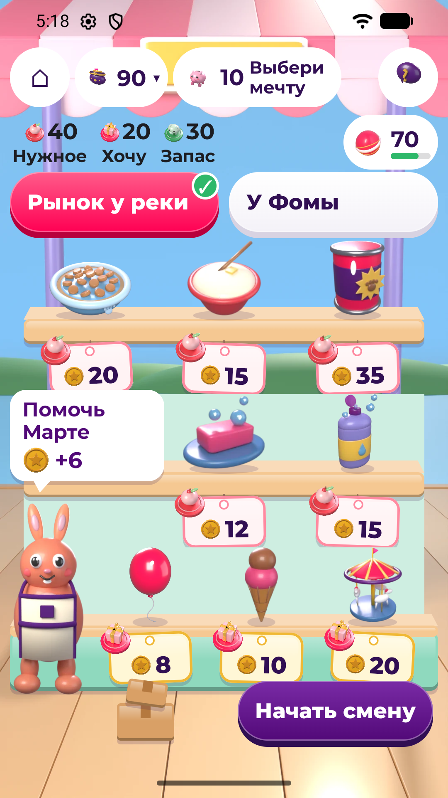
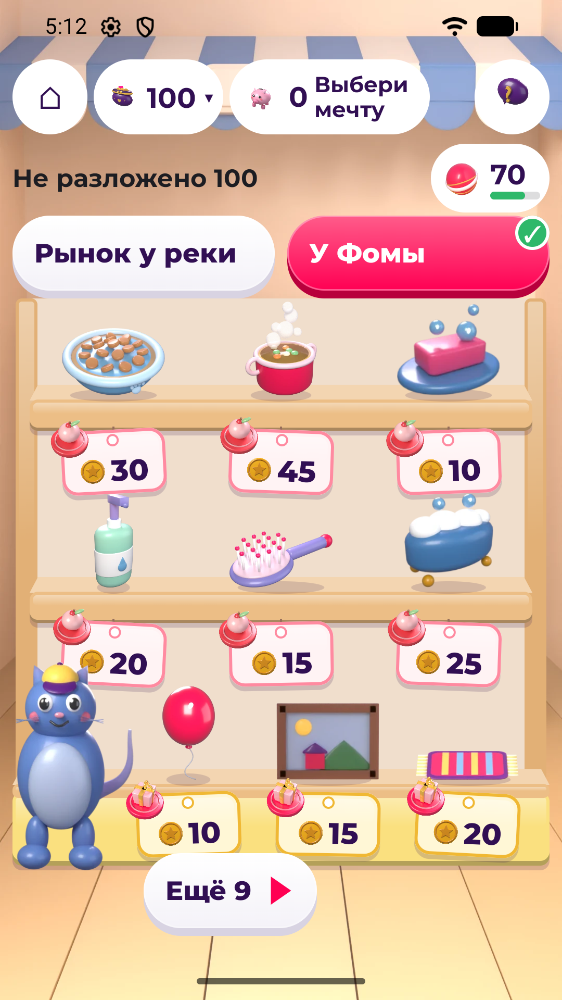

# Питомец Финни

Игра для Android, в которой ребёнок 7–11 лет учится обращаться с карманными деньгами: живёт
с питомцем в маленьком городке, раскладывает монеты по банкам, выбирает, где купить дешевле,
помогает соседям за зарплату и копит на мечту. Без регистрации, интернета, рекламы и реальных денег.

| | |
|---|---|
| Версия | 1.4.2 (versionCode 7), пакет `ru.finny.pet` |
| APK | 4,7 МБ (4 686 772 байт), Android 8.0 и новее, телефон, портретная ориентация |
| Конкурс | «Лидеры цифровой трансформации» 2026, кейс 06 |
| Заказчик | Департамент финансов города Москвы |
| Команда | «Сингулярность Бытия»: Ким Владимир, Цирпка Денис |
| Репозиторий | https://github.com/denis-zierpka/lct-hackaton-2026-case-06 |

## Запуск

### Установка готового APK

Файл — [`finny-pet/release/finny-pet-1.4.2-release.apk`](finny-pet/release/finny-pet-1.4.2-release.apk).
Скопировать на телефон и открыть, разрешив установку из неизвестных источников, или поставить
с компьютера:

```bash
adb install -r finny-pet/release/finny-pet-1.4.2-release.apk
```

Это тестовая сборка с временной подписью. Если на телефоне уже стоит «Питомец Финни» с другой
подписью, сначала удалите его: `adb uninstall ru.finny.pet`.

### Демо-режим для эксперта

Демо-режим открывает всё сразу, чтобы не проходить недели по порядку: события запускаются с доски,
в лавках доступны все товары, неделю можно сразу довести до итога. Игровая неделя — это 3 игровых
дня, а не календарь (день кончается сном в кровати), поэтому и без демо-режима недели идут подряд.

1. «Для взрослого» — кнопка на стартовом экране или значок замка в комнате.
2. Решить пример на умножение → «Войти».
3. «Создать тестовый профиль (демо)» → «Да, продолжить». Прогресс стирается, открывается
   знакомство — питомца создают заново.

Переключатель «Демо-режим» в том же разделе включает демо без сброса, «Сбросить профиль» —
начинает игру заново. В демо-режиме:

- на доске «События» — блок «Все события (демо)»: у каждого события кнопка «Начать»; «Список
  на неделю» запускается до раскладки монет, остальные — после неё;
- ночью, после раскладки по банкам, — «Сразу к итогу недели»;
- в лавках — все товары сразу, без ожидания следующих недель;
- в пекарне заказы не растут от смены к смене (1, 2, 2, 2 изделия).

Короткий путь по игре:

1. Создать питомца: вид, цвет, имя → «Начать!».
2. «Банки»: разложить 100 монет по банкам «Нужное», «Хочу», «В копилку» → «Готово» → «Да».
3. «Лавки»: купить корм на рынке у реки за 20 — в лавке «У Фомы» он стоит 30.
4. «События» → «Пекарне нужен помощник» → «К работе» → «Начать смену»: собрать поднос по заказу
   покупателя.
5. «Копилка»: выбрать мечту и доложить в неё из «Хочу».
6. Кровать «Сон» → «Сразу к итогу недели» → «Закончить неделю»: план и факт, штампы, рост питомца.
7. Закрыть приложение, открыть снова → «Продолжить»: всё сохранено.

Полный сценарий показа по Приложению А ТЗ с тем, что видно на каждом шаге, —
[BUILD_AND_DEMO.md](finny-pet/docs/BUILD_AND_DEMO.md#сценарий-демонстрации-приложение-а).

### Сборка из исходников

Нужны JDK 17 и Android SDK (platform 36, build-tools 36.0.0). Android Studio не обязательна:
wrapper сам скачает Gradle. Первой сборке нужен интернет, самому приложению — нет. Команды — из
каталога `finny-pet/`:

```bash
# Linux
./gradlew :app:testGameDebugUnitTest :app:assembleGameRelease

# Windows
gradlew.bat :app:testGameDebugUnitTest :app:assembleGameRelease
```

Путь к SDK — в `finny-pet/local.properties` или в `ANDROID_HOME`; на Windows двоеточие
экранируется: `sdk.dir=C\:/Users/<имя>/AppData/Local/Android/Sdk`. Готовый APK —
`finny-pet/app/build/outputs/apk/game/release/app-game-release.apk`. Подпись своим ключом, lint,
отладочная сборка и сброс профиля — [BUILD_AND_DEMO.md](finny-pet/docs/BUILD_AND_DEMO.md).

## Об игре

Игра для детей 7–11 лет, в которую ребёнок играет сам. Финансовой грамотности она учит не уроками,
а поступками: ребёнок решает, что купить, где и из какой банки, и видит, к чему это привело.
Ошибка не наказывается: питомец грустит, но не болеет и не умирает, а игра подсказывает, как всё
исправить. Взрослый видит прогресс ребёнка в своём разделе.

### Во что играет ребёнок

- **Питомец и комната.** Котик, зайка или щенок, три цвета, своё имя. Комната — главный экран:
  питомец, кошелёк, копилка с мечтой, сытость, чистота и настроение. Мебель ведёт к делам: полка
  с банками, холодильник со списком покупок, окно и дверь на улицу, почтовый ящик, сундук
  (обустроить комнату) и кровать «Сон».
- **Конверт и три банки.** Каждую игровую неделю почтальон приносит конверт: 100 монет карманных
  и то, что заработано на прошлой неделе. Монеты раскладываются по банкам «Нужное», «Хочу»
  и «В копилку» шагом 10, неразложенное остаётся запасом на всякий случай. После «Готово» план
  не меняется до нового конверта, а в конце недели сравнивается с тем, как вышло.
- **Две лавки с разными ценами.** На рынке у реки и в лавке «У Фомы» — 23 товара: нужные и для
  радости. Товары стоят на полках прямо в лавке: под каждым — ценник с ценой и значком отдела
  («нужное» или «хочу»), у прилавка — продавец; у Фомы товары листаются по 9. Одно и то же стоит
  по-разному: корм у реки 20, у Фомы 30; мыло 12 и 10. Нажатие на товар открывает кассу: она
  показывает название, цену, банку и что будет с питомцем. Если монет не хватает — говорит сколько
  и предлагает выход: вещь дешевле, взять из запаса или из «Хочу», подождать конверта, сделать
  вещь мечтой. Уйти в минус нельзя.
- **Работа у соседей.** В пекарне ребёнок собирает поднос по заказу покупателя, на рынке выполняет
  поручения торговки Марты. За смену — от 6 монет, в пекарне ещё до 4 за звёзды; не больше 3 смен
  в неделю. Зарплата приходит со следующим конвертом, поэтому план текущей недели не ломается.
  В пекарне есть «Загадка Бори» — пекарь Боря задаёт 15 вопросов по темам игры: за верный ответ он
  помогает собрать поднос.
- **События городка.** 6 событий, по два на тему «бюджет», «сбережения», «покупки»: «Список
  на неделю», «Корм подорожал», «Распродажа робота», «Мечта почти твоя», «Где дешевле»
  (два варианта: корм и мыло), «Супер-корм». Они решаются поступком: что и где купить, из какой банки, отложить или пройти
  мимо. После любого решения — короткое объяснение, после ошибки — как исправить.
- **Мечта и копилка.** 5 мечт — от красок за 80 до самоката за 150 — или своя. Банка «В копилку»
  ссыпается в свинку, докладывать можно из запаса и из «Хочу». Видно, сколько накоплено, сколько
  осталось и примерно через сколько конвертов мечта сбудется. Взять из копилки можно только после
  подтверждения.
- **Неделя и итог.** В неделе 3 игровых дня. В конце недели — итог: план и факт по банкам, три
  штампа («Нужное куплено», «По плану», «Отложено») и вопрос «Что поменяем в новом плане?».
- **Рост питомца без наказаний.** Штампы дают очки роста; стадий три: Малыш, Подросток (с 4 очков),
  Взрослый (с 9). Рост не откатывается.
- **«Дневник».** Рост, итоги недель, лучшая смена, что придёт с новым конвертом, журнал монет
  с источником каждого начисления, справка из 10 терминов.
- **Раздел для взрослого** — за простым барьером (пример на умножение): чему учит игра, прогресс
  ребёнка, бонус +10 монет в конверт (до 3 раз в неделю — за идею, как сэкономить, рассказ о мечте
  или совместное сравнение цен), звуки, музыка, анимации, демо-режим, сброс и удаление профиля.

### Чему учится

- понимать, зачем нужен бюджет и почему расходы не должны превышать доходы;
- отличать нужное от желаемого;
- планировать покупки, когда денег немного, и сравнивать цены;
- различать регулярный доход (карманные) и заработанный (зарплата за смену);
- ставить цель и регулярно откладывать на неё;
- оценивать свои решения и исправлять ошибки.

Механики опираются на Единую рамку компетенций по финансовой грамотности —
[docs/competencies.md](docs/competencies.md). Все числа экономики лежат в
[content.json](finny-pet/app/src/main/assets/content/content.json), формулы —
в [ECONOMY.md](finny-pet/docs/ECONOMY.md).

## Скриншоты

| Создание питомца | Комната — главный экран | Банки — бюджет недели |
|---|---|---|
|  |  |  |
| **Копилка и мечта** | **Улица** | **Пекарня** |
|  |  |  |
| **Рынок у реки — витрина** | **Лавка «У Фомы»** | |
|  |  | |

## Стек

| Что | Чем |
|---|---|
| Язык и интерфейс | Kotlin 2.4.20, Jetpack Compose (BOM 2026.06.01), Material 3, шрифт Montserrat |
| Данные | kotlinx.serialization 1.11.0: контент — `content.json` в assets приложения, профиль — `state.json` во внутренней памяти |
| Сборка | Gradle 9.4.1 (wrapper), Android Gradle Plugin 9.2.1, JDK 17 |
| Android | minSdk 26 (Android 8.0), compileSdk и targetSdk 36 |
| Тесты | JUnit 4.13.2: 619 JVM-тестов правил игры |
| Картинки и звуки | собственные: Blender и Python-скрипты в `finny-pet/tools/art/` |

Один Gradle-модуль, без сервера. Правила игры — чистый Kotlin без Android, их проверяют тесты;
учебный контент отделён от кода и лежит в `content.json`. Из того же кода собирается второй
вариант, `classic` — прежний интерфейс на Material 3; он остаётся в репозитории и в сдачу не входит.
Устройство проекта — [finny-pet/README.md](finny-pet/README.md) и
[ARCHITECTURE.md](finny-pet/docs/ARCHITECTURE.md).

## Реализованные требования

Полная таблица по ТЗ 7.1 п. 6 — со статусами, местом в коде, способом проверки и планом до финала —
[REQUIREMENTS_MATRIX.md](finny-pet/docs/REQUIREMENTS_MATRIX.md). Итог по ней: из 97 строк
79 «реализовано», 17 «в работе», 1 «не начато».

| Раздел ТЗ | Реализовано | В работе | Не начато |
|---|---|---|---|
| 2.1 Цель и задачи продукта | — | 1 | — |
| 2.5 Обязательные функции | 40 | 3 | — |
| 2.6–2.8 Объём контента, границы, дополнительные возможности | 14 | — | — |
| 3 Программно-аппаратные требования | 25 | 13 | 1 |

Реализовано:

- знакомство без регистрации, создание питомца, главный экран со всеми показателями (2.5.1–2.5.3);
- игровая валюта с источником каждого начисления, план недели по трём банкам и сравнение с фактом
  (2.5.4, 2.5.5);
- покупки через кассу без ухода в минус, мечты, копилка, снятие с подтверждением (2.5.6, 2.5.7);
- события по трём темам с объяснением после любого решения, путь исправления ошибки, 3 стадии
  роста питомца (2.5.8–2.5.10);
- справка с терминами, раздел для взрослого с бонусом, сохранение после перезапуска, демо-режим,
  новый контент без правки кода (2.5.11–2.5.14);
- минимальный объём контента: 9 вариантов питомца, 6 событий по 3 темам (7 вариантов), 23 товара, 5 мечт,
  3 стадии роста, недели подряд без ожидания (2.6);
- границы решения: нет реальных денег, банковских сервисов, рекламы, чатов, удалённого контроля (2.7);
- работа без интернета и без запросов разрешений, локальное хранение, тесты правил игры, тексты без запугивания,
  сброс и удаление данных взрослым (3).

В работе:

- срок мечты считается по среднему взносу, но из чего он получился, ребёнку пока не показано (2.5.7);
- списка пройденных событий в «Дневнике» и пройденных тем в разделе для взрослого пока нет
  (2.5.11, 2.5.12);
- не завершены проверки на реальных телефонах: весь сценарий показа, экранный диктор TalkBack,
  крупный шрифт (130 %), контрастность, звук, скорость на недорогом телефоне и работа на Android 8
  (2.1, 3.1, 3.4, 3.6);
- проверка с детьми (3.6, 8.4);
- подпись постоянным ключом, карточка в RuStore и проверка по правилам публикации (3.3, 3.5).

Не начато: планшет и альбомная ориентация (3.1.2, преимущество).

## Ограничения прототипа

- Питомец — простые 2D-картинки; объёмный питомец с анимацией — к финалу.
- Городок пока небольшой: на улице дом, две лавки и пекарня. К финалу появятся мастерская, дом
  Тоши — друга питомца — и места, которые открываются, когда сбывается мечта (парк, лес у озера,
  зоопарк), а вместе с ними новые события.
- Событие не повторяется, кроме тех, что игра сама предлагает повторить на следующей неделе.
  Когда все пройдены, остаются неделя с банками, покупки, работа, загадки и мечты. В демо-режиме
  события запускаются с доски вручную.
- Один профиль на устройстве, только русский язык и только портретная ориентация.
- Итоговая версия выйдет с другой подписью: поверх этой сборки она не установится, приложение
  придётся переустановить, и игра начнётся заново.

Весь список и план до финала — [LIMITATIONS_ROADMAP.md](finny-pet/docs/LIMITATIONS_ROADMAP.md).

## Документация

В [`finny-pet/docs/`](finny-pet/docs/), по разделу 5 ТЗ:

- [BUILD_AND_DEMO.md](finny-pet/docs/BUILD_AND_DEMO.md) — окружение, сборка, подпись, установка,
  демо-режим, сценарий показа
- [ARCHITECTURE.md](finny-pet/docs/ARCHITECTURE.md) — компоненты, поток данных, обновление контента
- [DATA_MODEL.md](finny-pet/docs/DATA_MODEL.md) — профиль, контент, прогресс
- [REQUIREMENTS_MATRIX.md](finny-pet/docs/REQUIREMENTS_MATRIX.md) — матрица требований
- [ECONOMY.md](finny-pet/docs/ECONOMY.md) — формулы: монеты, банки, касса, смены, рост питомца
- [CONTENT_MAP.md](finny-pet/docs/CONTENT_MAP.md) — темы, навыки, события, объяснения
- [UX_ACCESSIBILITY.md](finny-pet/docs/UX_ACCESSIBILITY.md) — интерфейс и доступность
- [PRIVACY_PERMISSIONS.md](finny-pet/docs/PRIVACY_PERMISSIONS.md) — разрешения, данные, удаление профиля
- [TEST_CASES.md](finny-pet/docs/TEST_CASES.md) — тест-кейсы и отчёт о проверке
- [LIMITATIONS_ROADMAP.md](finny-pet/docs/LIMITATIONS_ROADMAP.md) — ограничения и план до финала
- [LICENSES.md](finny-pet/docs/LICENSES.md) — библиотеки, шрифты, изображения, звуки

Ещё:

- [QUESTIONS.md](finny-pet/docs/QUESTIONS.md) — вопросы заказчику
- [USER_TESTING.md](finny-pet/docs/USER_TESTING.md) — протокол проверки с детьми и взрослыми
- [RUSTORE_CARD.md](finny-pet/docs/RUSTORE_CARD.md) — черновик карточки RuStore
- [finny-pet/CHANGELOG.md](finny-pet/CHANGELOG.md) — история выпусков
- [docs/GAME_CONCEPT.md](docs/GAME_CONCEPT.md) — концепция игры
- [docs/competencies.md](docs/competencies.md) — привязка механик к рамке компетенций
- как велась разработка — [docs/WORKFLOW.md](docs/WORKFLOW.md)

## Структура репозитория

```
finny-pet/               Android-проект (Gradle), сборка — отсюда
  app/src/main/          общий код: правила игры (domain/), данные (data/), контент content.json
  app/src/game/          сдаваемый вариант: экраны, картинки, звуки
  app/src/classic/       прежний интерфейс, в сдачу не входит
  app/src/test/          тесты правил игры
  docs/                  документация для сдачи
  release/               готовый APK
  screenshots/game/      ключевые экраны
  tools/art/             генераторы картинок и звуков
docs/                    ТЗ и рамка компетенций (sources/), концепция игры, рабочие материалы команды
tools/                   служебные скрипты команды: проверка экранов на эмуляторе и телефоне,
                         проверка тестов и картинок, генерация части документации
.claude/, CLAUDE.md      настройки ИИ-ассистента, с которым велась разработка (см. docs/WORKFLOW.md)
```

## Промежуточная сдача (ТЗ 7.1)

| № | Что требует ТЗ 7.1 | Где |
|---|---|---|
| 1 | Git-репозиторий | ссылка — в шапке |
| 2 | README: стек, запуск, реализованные требования | [Стек](#стек), [Запуск](#запуск), [Реализованные требования](#реализованные-требования) |
| 3 | Рабочая сборка APK | [Установка готового APK](#установка-готового-apk) |
| 4 | Архитектура и структура данных | [ARCHITECTURE.md](finny-pet/docs/ARCHITECTURE.md), [DATA_MODEL.md](finny-pet/docs/DATA_MODEL.md), [ECONOMY.md](finny-pet/docs/ECONOMY.md) |
| 5 | Ключевые экраны | [Скриншоты](#скриншоты), файлы — [finny-pet/screenshots/game/](finny-pet/screenshots/game/) |
| 6 | Требования со статусами и планом до финала | [REQUIREMENTS_MATRIX.md](finny-pet/docs/REQUIREMENTS_MATRIX.md), [план до финала](finny-pet/docs/LIMITATIONS_ROADMAP.md#план-до-финала-тз-72) |
| 7 | Вопросы и ограничения для консультации с заказчиком | [QUESTIONS.md](finny-pet/docs/QUESTIONS.md) |

## Лицензия

Открытой лицензии нет. Код, картинки, звуки, музыка и тексты созданы командой «Сингулярность
Бытия» для конкурса и распространяются в составе прототипа. Сторонние библиотеки и шрифт —
со своими лицензиями, перечень — [LICENSES.md](finny-pet/docs/LICENSES.md).
