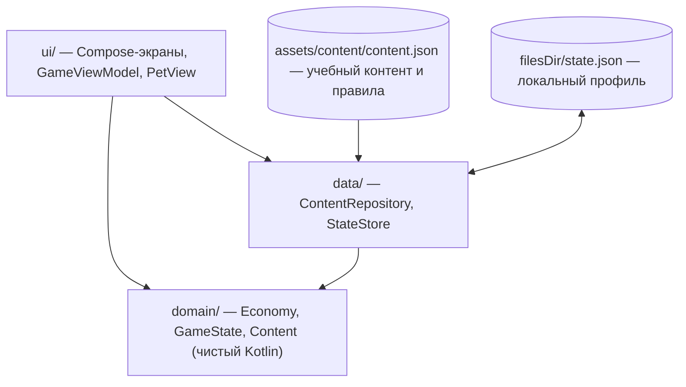

# Архитектура

Один Gradle-модуль `app`, четыре слоя, разделённых пакетами. Зависимости направлены только вниз: UI → данные → домен; домен ни от чего не зависит.



## Компоненты

| Компонент | Файлы | Ответственность |
|---|---|---|
| Домен: модели | `domain/Content.kt`, `domain/GameState.kt` | Схема контента и состояния профиля, `@Serializable` |
| Домен: правила | `domain/Economy.kt` | Все расчёты: план, покупки, копилка, задания, конец недели, рост, выражение питомца. Каждая операция — чистая функция `GameState → Outcome` (новое состояние + объяснения или ошибка с вариантами) |
| Данные: контент | `data/ContentRepository.kt` | Чтение `content.json` из assets |
| Данные: профиль | `data/StateStore.kt` | Чтение/атомарная запись `state.json` |
| UI: состояние | `ui/GameViewModel.kt` | Текущий экран, диалоги обратной связи, вызов правил и сохранение |
| UI: оболочка | `ui/App.kt` | Тема, `NavigationSuiteScaffold` (нижняя панель / рейл), анимированная смена экранов, диалоги обратной связи |
| UI: экраны | `ui/screens/*.kt` | Знакомство, создание питомца, главный, план, магазин, копилка, задания, прогресс, справка, итог недели, раздел для взрослого |
| UI: питомец | `ui/PetView.kt`, `ui/PetSprites.kt` | Показ пререндеренного 3D-спрайта (вид × цвет × стадия × выражение, WebP в `res/drawable-nodpi`) и анимации: дыхание, моргание, прыжок, тень. Спрайты строит `tools/art/pet.py` (Blender) |
| UI: общее | `ui/Components.kt`, `ui/Theme.kt`, `ui/Colors.kt` | Каркас экрана с app bar, кнопки, карточки, чипы, диалоги, полосы показателей; тема M3 и сгенерированные схемы цвета |

## Поток данных

1. Пользователь нажимает кнопку → экран вызывает метод `GameViewModel` (например `buy(itemId)`).
2. ViewModel вызывает `Economy.buy(state, itemId)` и получает `Outcome.Ok(newState, messages)` либо `Outcome.Error(message, hints)`.
3. При `Ok` состояние заменяется целиком и сразу сохраняется в `state.json`; сообщения показываются диалогом «что изменилось и почему».
4. При `Error` состояние не меняется; показывается диалог «Пока не получится» с вариантами действий.

Состояние неизменяемое (`data class`, `copy`), поэтому история изменений прозрачна, а тесты не нуждаются в Android.

## Навигация

`sealed interface Screen` в `GameViewModel`; смена экрана — присваивание. Пять основных разделов (Питомец, План, Магазин, Копилка, Задания) показываются через `NavigationSuiteScaffold`: нижняя панель на телефоне, рейл при ширине окна ≥ 600 dp. Второстепенные экраны (задание, прогресс, справка, итог недели, раздел для взрослого, знакомство) открываются поверх с кнопкой «назад» в app bar. Системная кнопка «Назад» обрабатывается `BackHandler` и ведёт на известного родителя (задание → список заданий, справка → прогресс, остальное → главный). Библиотека navigation-compose не используется.

## Хранение

`filesDir/state.json` — один JSON-документ `GameState` (kotlinx.serialization). Запись атомарная: временный файл + переименование; повреждённый файл переименовывается в `state.json.bad`, а не затирается. Никаких сетевых вызовов, разрешений, аккаунтов.

## Схема обновления учебного контента

Контент полностью отделён от кода: задания, товары, цели, глоссарий, вид/цвет питомца и числовые правила лежат в `app/src/main/assets/content/content.json`.

Добавить задание = добавить объект в массив `tasks`:

```json
{
  "id": "savings_new", "theme": "SAVINGS", "title": "Новое задание", "type": "CHOICE", "unlockPeriod": 2,
  "situation": "Описание ситуации...",
  "options": [
    { "text": "Вариант А", "correct": true,  "explanation": "Почему верно" },
    { "text": "Вариант Б", "correct": false, "explanation": "Почему нет" }
  ]
}
```

Поддерживаются типы `CHOICE` (варианты с объяснением каждого) и `NUMBER` (числовой ответ, поля `answer`, `explanationCorrect`, `explanationWrong`). Тест `ContentTest` при сборке проверяет, что у каждого задания ровно один верный вариант, объяснения непустые, id уникальны и минимальный объём контента из ТЗ соблюдён. Экраны читают контент через `Content`, поэтому код не меняется.

## Сборка

Kotlin 2.4 (встроенная поддержка в AGP 9.2), Jetpack Compose BOM 2026.06.01: Material 3 1.4.0, `material3-adaptive-navigation-suite`, `material-icons-extended`; kotlinx.serialization 1.11; minSdk 26 (Android 8.0), targetSdk 36. Release-сборка минифицируется R8 (неиспользуемые иконки вырезаются); правила для сериализаторов — в `app/proguard-rules.pro`. Цветовая схема генерируется скриптом `tools/office/gen_theme.js` (material-color-utilities) в `ui/Colors.kt`.
